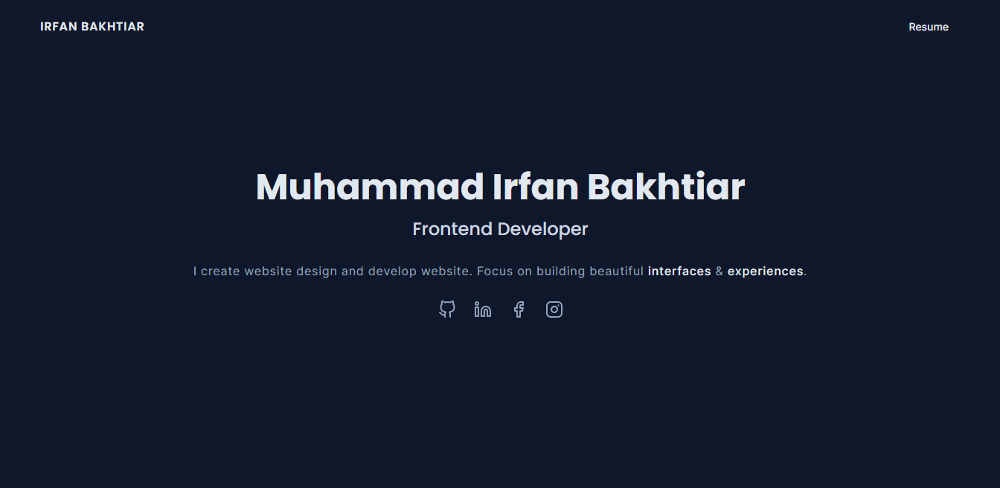

<!-- PROJECT LOGO -->
<br />
<div align="center">
  <a href="https://github.com/irfanbakhtiar/larawind-portfolio">
    
  </a>

  <h3 align="center">IrfanBakhtiar-V2</h3>

  <p align="center">
    Second version of my personal site built with Nextjs, Reactjs and Tailwind CSS
    <br />
    <a href="https://github.com/irfanbakhtiar/v2portfolio/issues">Report Bug</a>
<!--     ·
    <a href="https://github.com/irfanbakhtiar/v2portfolio/issue">Request Feature</a> -->
  </p>
</div>

### Built With

This project uses the following framework:

- <a href="https://www.nextjs.org">Next.js</a>
- <a href="https://www.react.dev">React.js</a>
- <a href="https://www.tailwindcss.com">Tailwind CSS</a>

This project uses the following plugin:

- <a href="https://github.com/basecamp/trix">React Icons</a>

<!-- FEATURES -->

### Features

The project has features such as:

- About Section
- Experience Section
- Projects Section

<!-- GETTING STARTED -->

## Getting Started

This is a step about setting up your project locally. To get a local copy up and running, follow these simple example steps.

### Prerequisites

To clone and run this application, you'll need [Git](https://git-scm.com) and [Node.js](https://nodejs.org/en/download/) (which comes with [npm](http://npmjs.com)) installed on your computer.

### Installation

_Below are the procedures for installing and setting up your app._

1. Clone the repo
   ```sh
   git clone https://github.com/irfanbakhtiar/v2portfolio.git
   ```
2. Install NPM
   ```sh
   npm install
   ```
3. Run development server
   ```sh
   npm run dev
   ```
